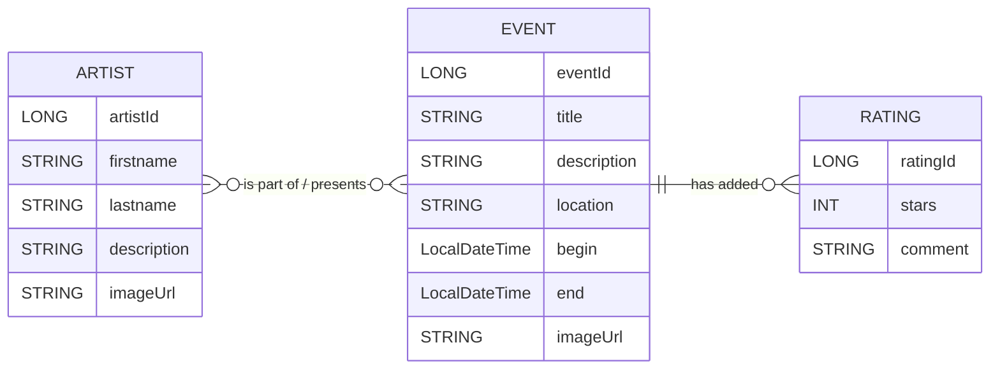

# VibeCheck - Music Event Manager

## Guidelines for the REST-Backend

- Spring Boot with Spring Data JPA  
- Initial data is provided as a json-file  
- ER-diagram

## ER-Diagram

Unterlagen und Theorie: 

- "JSON with jackson"-Skriptum von Prof. Schiffermüller  
- Differences between Entities and DTOs  
  https://www.baeldung.com/java-entity-vs-dto  
- One-To-Many unidirectional Relationship in JPA  
  https://www.baeldung.com/spring-jpa-unidirectional-one-to-many-and-cascading-delete
- Many-To-Many Relationship in JPA  
  https://www.baeldung.com/jpa-many-to-many  

Damit SpringBoot-Backends auch Daten bereitstellen können, müssen diese auch von irgendwoher kommen.  
Mögliche Datenquellen: 
- XML-Datei (JAXB)
- JSON-Datei (Jackson)
- Existierende Datenbank
- Anderes REST-API
- ...

Für dieses Beispiel steht uns eine JSON-Datei zur Verfügung! 

1. Deine Aufgabe ist es die json-Datei als DTOs einzulesen.  
   (Überprüfe dann im Debug Modus, ob JsonDataWrapper vollständig ist)  
2. Deine Aufgabe ist es mit Entity-Klassen das Datenbankschema zu erzeugen.  
   (Überprüfe dann, ob die Beziehungen in den Tabellen richtig umgesetzt sind)
3. Erzeuge die Repositories
4. Vervollständige den DataSeeder. Überlege welche Entity-Objekte du zuerst erzeugst, um dann auch die Referenzen setzen zu können. 
Verwende dann das Repository, um deine Entity-Objekte persistieren zu können.    

Gutes Gelingen 